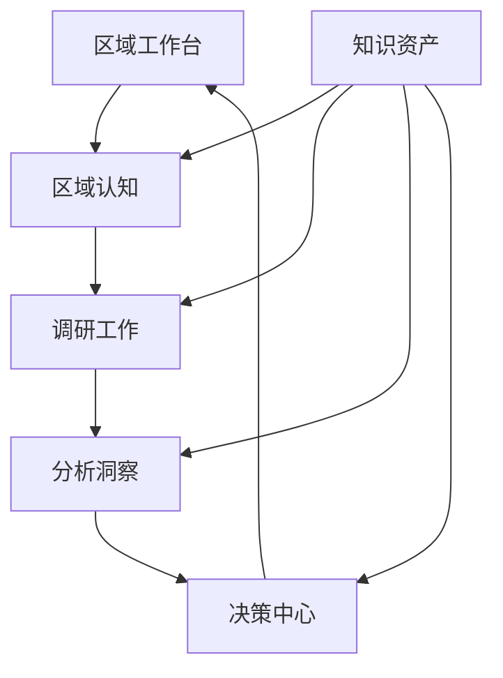
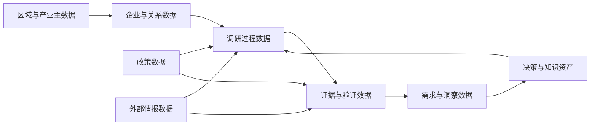
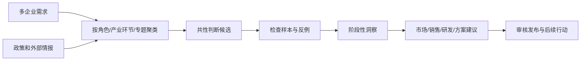
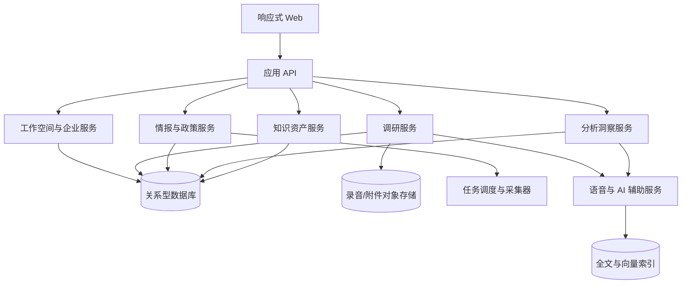

# 区域产业调研与机会决策系统设计方案

> 文档版本：2.0
>
> 设计重点：业务架构、信息架构、数据架构和可演进技术架构

## 1. 设计目标

系统以“区域工作空间”为业务边界，以“证据链”为分析基础，以“平台知识资产”为跨区域复用载体。阎良是首个区域实例，后续区域使用相同业务模型，但保留独立的企业、调研、情报和结论。

设计必须保证：

- 用户知道当前处于区域认知、调研执行、分析洞察还是决策阶段。
- 事实、线索、判断、需求、洞察和建议不会混为一谈。
- 任意结论能回溯到企业访谈或外部来源。
- 政策和情报可持续更新，并触发重新分析。
- AI 负责提取和建议，用户负责确认和发布。

## 2. 业务架构



### 2.1 区域认知域

管理产业模型、产业环节、企业、企业关系、政策和动态情报，回答“区域中客观存在什么”。

### 2.2 调研执行域

管理研究问题、样本选择、计划、准备包、问题、录音、转写、纪要、需求候选和行动项，回答“本轮调研如何开展”。

### 2.3 分析洞察域

管理专题、假设、证据、反例、需求聚类、阶段结论和可信度，回答“这些信息说明什么”。

### 2.4 决策域

管理市场、销售、产品研发、方案和生态合作建议，回答“团队接下来做什么”。

### 2.5 知识资产域

管理可跨区域复用的能力、案例、问题模板、行业模型、方案和数据源配置。

## 3. 信息架构

```text
区域工作台
区域认知
  ├─ 产业全景
  ├─ 企业库
  ├─ 政策库
  └─ 动态情报
调研工作
  ├─ 调研对象与样本
  ├─ 调研计划
  ├─ 调研准备包
  └─ 调研记录与行动项
分析洞察
  ├─ 研究专题
  ├─ 需求洞察
  ├─ 企业群对比
  └─ 证据与反例
决策中心
  ├─ 市场与销售建议
  ├─ 产品与研发建议
  ├─ 行业方案建议
  └─ 区域研究简报
知识资产
  ├─ 能力与案例
  ├─ 问题模板
  ├─ 行业模型
  └─ 数据源配置
```

数据看板不再作为孤立菜单：区域驾驶舱放在区域工作台，专题统计放在研究专题，全局看板在多区域阶段提供。

## 4. 数据架构设计

### 4.1 数据分层

| 层级 | 定义 | 示例 | 是否可直接用于决策 |
| --- | --- | --- | --- |
| 原始数据层 | 未经解释的原始内容 | 录音、转写、政策原文、招标原文 | 否 |
| 事实与线索层 | 从来源中识别出的客观信息或信号 | 企业扩产、发布招标、政策申报窗口 | 否，需结合上下文 |
| 结构化研究层 | 经人工确认的调研结果 | 企业需求、阻塞项、行动项、政策诉求 | 可作为分析输入 |
| 洞察层 | 多企业、多证据形成的归纳 | 共性需求、产业矛盾、反例、趋势 | 审核后可用 |
| 决策层 | 面向经营行动的建议 | 销售策略、研发方向、方案建议 | 审核发布后使用 |

### 4.2 数据域



### 4.3 核心实体及主要字段

#### 区域与产业

| 实体 | 主要字段 | 说明 |
| --- | --- | --- |
| Workspace | id、name、regionCode、regionName、industryFocus、status | 区域数据边界 |
| IndustryModel | id、scope、name、version、status | 可共享或区域覆盖的产业模型 |
| IndustryStage | id、modelId、name、parentId、order | 产业环节层级 |
| IndustryTopic | id、workspaceId、name、purpose、status、ownerId | 研究专题 |

#### 企业与关系

| 实体 | 主要字段 | 说明 |
| --- | --- | --- |
| Company | id、workspaceId、name、groupId、industry、companyType、stageId、scale、status | 区域企业档案 |
| CompanySource | id、companyId、sourceType、sourceUrl、capturedAt、verifiedAt | 企业信息来源 |
| CompanyRelation | id、workspaceId、sourceCompanyId、targetCompanyId、relationType、evidenceId、confidence | 设计、制造、验证、供应等关系 |
| Contact | id、companyId、name、role、contactInfo、sensitivity | 企业联系人 |

#### 调研过程

| 实体 | 主要字段 | 说明 |
| --- | --- | --- |
| ResearchQuestion | id、workspaceId、topicId、statement、status、origin | 本轮需要回答的研究问题 |
| Hypothesis | id、questionId、statement、status、confidence | 待验证判断 |
| ResearchSample | id、questionId、companyId、sampleRole、reason | 调研样本及选择理由 |
| ResearchPlan | id、workspaceId、name、objective、ownerId、startAt、endAt、status | 调研计划 |
| PlanCompany | planId、companyId、questionIds、hypothesisIds | 计划与企业的关联 |
| InterviewPack | id、planId、companyId、version、generatedAt | 企业调研准备包 |
| InterviewQuestion | id、packId、category、content、basisType、basisId、order | 问题及生成依据 |
| ResearchRecord | id、planId、companyId、interviewedAt、summary、status | 一次访谈记录 |
| Attachment | id、recordId、type、storageKey、fileName、createdAt | 录音和附件 |
| Transcript | id、recordId、version、content、status | 转写版本 |
| ActionItem | id、recordId、companyId、content、ownerId、dueAt、status | 后续行动 |

#### 证据、需求与洞察

| 实体 | 主要字段 | 说明 |
| --- | --- | --- |
| Evidence | id、workspaceId、sourceType、sourceId、excerpt、location、confidence、verificationStatus | 可引用证据 |
| NeedStatement | id、companyId、recordId、category、content、claimType、status、confirmedBy | 企业级需求陈述 |
| NeedEvidence | needId、evidenceId、relationType | 需求与支持/反对证据 |
| Insight | id、workspaceId、topicId、type、statement、confidence、status、ownerId | 共性需求、趋势或产业判断 |
| InsightEvidence | insightId、evidenceId、relationType | 洞察的支持证据和反例 |
| DecisionRecommendation | id、workspaceId、insightId、category、content、priority、status | 市场/销售/研发等建议 |

#### 政策与动态情报

| 实体 | 主要字段 | 说明 |
| --- | --- | --- |
| Policy | id、scope、workspaceId、title、publisher、status、currentVersionId | 政策主记录 |
| PolicyVersion | id、policyId、version、publishedAt、validFrom、validTo、sourceUrl、content | 历史版本 |
| PolicyRule | id、policyVersionId、targetTypes、conditions、supportType、supportValue | 适用和支持条件 |
| PolicyMatch | id、policyVersionId、companyId、status、matchedConditions、missingConditions、explanation、calculatedAt | 企业政策匹配 |
| IntelligenceItem | id、workspaceId、type、title、sourceUrl、publishedAt、capturedAt、content、verificationStatus | 外部动态 |
| IntelligenceLink | intelligenceId、entityType、entityId、relationType、confirmedBy | 与企业、专题等的关联 |
| CollectionJob | id、workspaceId、sourceId、keywords、frequency、lastRunAt、status | 自动更新任务 |

#### 平台知识资产

| 实体 | 主要字段 | 说明 |
| --- | --- | --- |
| Capability | id、scope、name、description、tags、status | 服务能力 |
| CaseAsset | id、scope、industry、scenario、problem、solution、result、evidence | 案例资产 |
| QuestionTemplate | id、scope、category、applicableRoles、content、version | 问题模板 |
| SolutionAsset | id、scope、name、applicableInsights、prerequisites、status | 方案资产 |

### 4.4 关键状态定义

#### 证据验证状态

`待验证 → 已核实 → 已引用`，或进入`无法核实/已失效`。

#### 企业需求状态

`待提取 → 待确认 → 企业已确认/证据支持 → 已归纳`；如有反证则标记`存在反例`，过期后标记`已失效`。

#### 洞察状态

`草稿 → 证据积累中 → 待审核 → 已发布 → 已过期`。

#### 政策匹配状态

`待计算 → 已匹配/部分匹配/不匹配 → 需重新计算`。政策版本、企业画像或调研结论变化时进入“需重新计算”。

### 4.5 数据隔离与共享

- 区域原始数据必须带 `workspaceId`。
- 平台知识资产使用 `scope=platform`，区域定制使用 `scope=workspace`。
- 同一集团在不同区域的企业可通过 `groupId` 关联，但访谈和敏感联系人不自动共享。
- 跨区域分析读取已治理的结构化需求和洞察，不默认读取全部原始录音。

## 5. 数据流转设计

### 5.1 外部情报流转


情报不能直接生成企业需求，只能进入调研准备和研究证据候选。

### 5.2 调研数据流转


### 5.3 洞察与决策流转



### 5.4 数据变更触发

| 变更 | 系统动作 |
| --- | --- |
| 新增企业情报 | 更新企业时间线，建议关联专题和调研问题 |
| 政策新版本 | 旧匹配标记为需重新计算 |
| 企业画像更新 | 重新计算政策适配和调研准备包 |
| 新调研记录确认 | 更新企业需求、专题证据和区域统计 |
| 洞察发布 | 更新区域驾驶舱和决策中心 |
| 洞察过期或出现反例 | 标记相关建议需复核 |

## 6. 应用与服务架构



首期本地前端用于验证业务；进入团队和多区域阶段时，推荐使用关系型数据库保存结构化关系、对象存储保存原始文件、全文/向量索引辅助检索，但业务模型不依赖具体产品。

## 7. AI 设计边界

| 场景 | AI 输出 | 必须保留 |
| --- | --- | --- |
| 录音转写 | 转写文本和时间片段 | 原始录音、转写版本 |
| 纪要提取 | 需求候选、阻塞项、行动项 | 原文位置、待确认状态 |
| 问题生成 | 分类问题及生成依据 | 用户编辑版本 |
| 情报归类 | 类型、企业和专题候选 | 原始来源、人工确认结果 |
| 共性分析 | 聚类、趋势和反例候选 | 样本范围、证据引用 |
| 决策简报 | 建议草稿 | 人工审核者和发布版本 |

## 8. 安全与审计

- 录音、联系人和企业敏感信息按区域和角色控制访问。
- 关键实体保留创建人、修改人、确认人和时间。
- 政策、情报、转写、洞察和决策建议采用版本管理。
- AI 生成、人工修改、审核发布均记录审计日志。
- 自动采集遵守数据源授权、访问频率和使用范围。

## 9. 实施顺序

1. 重整信息架构和区域工作台。
2. 完成企业、产业、政策和情报的事实数据层。
3. 完成调研样本、准备包、记录、需求确认和行动项闭环。
4. 完成研究专题、证据、反例、洞察和决策中心。
5. 接入政策更新、动态采集、语音转写和 AI 辅助。
6. 引入服务端、权限、多区域比较和平台知识资产。
