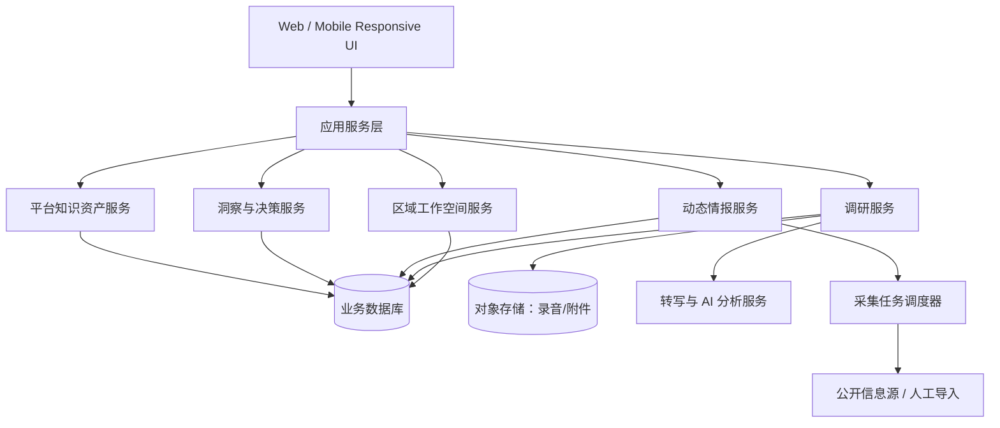

# 区域产业调研与机会决策系统设计方案

## 1. 设计目标

系统采用“区域工作空间 + 平台级知识资产”的架构：

- 区域工作空间承载一地产业调研的原始事实、过程记录和业务结论。
- 平台级知识资产承载可跨区域复用的行业模型、能力库、案例库、问题模板和政策解析。
- 决策分析层将区域事实与平台知识连接，但必须保留证据来源和推断边界。

## 2. 架构原则

1. **区域隔离，知识共享**：原始企业与访谈数据按区域隔离；模板、能力、案例和经治理洞察可复用。
2. **事实与推断分离**：公开情报、调研原话、人工判断、AI 推断分别存储并标注来源。
3. **企业档案统一入口**：企业详情抽屉作为跨页面复用组件，不同入口不复制详情逻辑。
4. **先人工可用，再自动增强**：先支持人工录入/导入与调研闭环；再接入抓取、转写和 AI。
5. **规则与模型可配置**：产业分类、政策匹配、问题模板、情报关键词和评分规则不硬编码为唯一逻辑。

## 3. 总体架构



## 4. 前端设计

### 4.1 当前实现

首期采用 React + TypeScript + Vite，实现单页工作台：

- 数据看板
- 企业名单
- 产业链地图
- 问题生成
- 政策匹配
- 调研计划
- 调研记录
- 需求归纳
- 建议结论

当前通过浏览器本地持久化验证业务流程。该实现适合单人试点，不作为团队与多区域阶段的最终数据架构。

### 4.2 统一企业详情组件

`CompanyProfileDrawer` 是统一企业档案容器，应由应用级状态打开，而非由企业列表页面私有控制。

输入：

- `companyId`
- `workspaceId`
- 可选入口上下文，例如产业地图、企业列表、政策列表或搜索结果

输出内容：

- 基础画像
- 产业角色与关联关系
- 调研历史、需求、结论、行动项
- 外部情报与招投标线索
- 政策适配
- 调研问题与计划入口
- 编辑入口

所有入口只负责传递企业标识；详情内容、编辑、数据刷新和跳转行为由统一组件处理。

### 4.3 响应式策略

- PC：侧边栏 + 主工作区 + 右侧企业详情抽屉。
- 手机：导航折叠；产业地图横向浏览；企业详情全屏抽屉；录音和待办优先。
- 图表与产业网络避免通过缩小文字适配小屏，应采用横向滚动、分组切换或摘要层级。

## 5. 领域模型

### 5.1 多区域工作空间

```text
Workspace
  id
  name
  regionCode
  regionName
  industryFocus[]
  status
  createdAt

WorkspaceMember (后续)
  workspaceId
  userId
  role
```

### 5.2 企业与产业关系

```text
Company
  id
  workspaceId
  name
  groupId?
  industry
  companyType
  chainPosition
  maturity
  status
  profile

IndustryModel
  id
  scope: platform | workspace
  name
  stages[]

CompanyRelation
  id
  workspaceId
  sourceCompanyId
  targetCompanyId
  relationType
  evidenceId?
  confidence
```

`CompanyRelation` 不应只保存静态“上下游”标签，还应支持设计输入、工艺转化、供应链配套、试验验证、问题反馈、数据协同等关系类型。

### 5.3 调研与证据模型

```text
ResearchHypothesis
  id
  workspaceId
  topicId?
  statement
  status: pending | supported | contradicted | inconclusive

ResearchPlan
  id
  workspaceId
  targetType: company | company_group | topic
  targetId
  objectives[]
  hypothesisIds[]

ResearchRecord
  id
  workspaceId
  companyId
  planId?
  summary
  transcript
  conclusion

Evidence
  id
  workspaceId
  entityType
  entityId
  sourceType: interview | tender | policy | news | manual | ai
  sourceUrl?
  publishedAt?
  capturedAt
  confidence
  verificationStatus

Need
  id
  workspaceId
  companyId?
  topicId?
  category
  description
  priority
  evidenceIds[]
```

### 5.4 情报、政策与知识资产

```text
IntelligenceItem
  id
  workspaceId
  companyId?
  topicId?
  type: tender | procurement | policy | news | hiring | expansion | certification
  title
  sourceUrl
  publishedAt
  capturedAt
  summary
  confidence
  verificationStatus

Policy
  id
  scope: national | province | city | district | park
  workspaceId?
  title
  appliesTo
  support
  deadline?
  sourceUrl

Capability / Case / QuestionTemplate
  id
  scope: platform | workspace
  tags[]
  version
```

## 6. 服务设计与接口边界

| 服务 | 职责 | 后续接口示例 |
| --- | --- | --- |
| 工作空间服务 | 区域、产业主线、成员、数据边界 | `/workspaces` |
| 企业服务 | 企业档案、集团关联、企业关系 | `/workspaces/:id/companies` |
| 产业研究服务 | 产业模型、专题、假设、协同网络 | `/workspaces/:id/topics` |
| 调研服务 | 计划、问题包、记录、录音、需求、行动项 | `/research-plans`, `/research-records` |
| 情报服务 | 信息源、采集任务、情报条目、去重和待验证 | `/intelligence-items`, `/collector-jobs` |
| 政策服务 | 政策库、适配规则、申报窗口 | `/policies`, `/policy-matches` |
| 洞察服务 | 聚类、趋势、简报、建议和证据链 | `/insights`, `/decision-briefs` |
| 知识资产服务 | 能力、案例、模板、行业模型版本 | `/knowledge-assets` |

## 7. 动态信息采集设计

### 7.1 采集模式

1. 人工录入：首期必备，支持来源和附件。
2. 文件导入：Excel、政策材料、企业清单。
3. 定时任务：按企业名和关键词检索公开信息源。
4. 手动刷新：对重点企业或专题即时更新。

### 7.2 采集治理

- 采集任务配置查询词、信息源、频率、区域和关联主题。
- 条目通过标题、URL、时间和文本相似度去重。
- 新条目默认进入“待验证”，由用户确认后影响研究结论。
- 禁止绕过访问控制或违反来源网站规则；优先使用官方公开信息和授权数据源。

## 8. AI 能力设计

AI 只作为辅助研究工具，不替代调研判断。

| 场景 | 输入 | 输出 | 控制要求 |
| --- | --- | --- | --- |
| 录音转写 | 录音文件 | 转写文本、说话片段 | 保留原始录音与转写版本 |
| 纪要提取 | 转写/笔记 | 需求、预算、阻塞项、行动项 | 每项绑定原文证据 |
| 问题生成 | 企业角色、情报、假设、历史记录 | 分类问题包 | 显示生成依据，允许编辑 |
| 情报归类 | 公开条目 | 类型、关联企业、关键词 | 默认待验证 |
| 共性洞察 | 多条结构化需求与证据 | 聚类、趋势、反例 | 不将样本推断包装为确定事实 |
| 决策简报 | 专题、证据、结论 | 市场/产品/销售建议草稿 | 引用证据并标注不确定性 |

## 9. 技术演进路线

### 阶段 1：单人试点

- React 前端、本地持久化、Excel 导入、录音上传、手工政策与情报维护。

### 阶段 2：团队化与服务端

- 后端 API、关系型数据库、对象存储、身份认证、工作空间和权限。
- 推荐 PostgreSQL + 对象存储；支持全文检索和结构化标签查询。

### 阶段 3：自动化与智能化

- 任务调度、信息源连接器、语音转写、向量检索、AI 分析服务、证据引用与审计。

### 阶段 4：跨区域决策

- 多区域对比看板、行业专题横向分析、平台级方案资产推荐、经营决策简报。

## 10. 安全、权限与审计预留

虽然首期不做登录，数据模型和接口应预留：

- `workspaceId`：区域范围。
- `createdBy` / `updatedBy`：数据责任人。
- `visibility`：私有、区域共享、平台共享。
- `sourcePermission`：外部数据源使用范围。
- `auditLog`：关键编辑、导出、删除和 AI 生成结论的审计记录。

